# Diagramas — pipeline Notion → n8n → Postiz → Instagram

> **Qué es esto:** el mapa visual de la automatización descrita en
> [CONTENT_PIPELINE_NOTION_POSTIZ.md](./CONTENT_PIPELINE_NOTION_POSTIZ.md).
> Ese documento explica **por qué** cada cosa es como es; éste enseña **cómo encaja**.
>
> **Fecha:** 2026-08-04 · refleja lo que está desplegado y activo.
> Si un diagrama y el sistema no coinciden, manda el sistema — y hay que corregir el diagrama.

---

## 1. Las cuatro piezas y quién manda

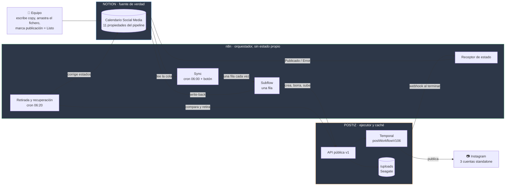

**La regla que sostiene todo:** las flechas hacia Notion salen **sólo de n8n**.
Postiz nunca escribe en Notion. Dos escritores serían ninguna verdad.

---

## 2. El planificador — `eKxZPM4zjwhNb3vf`

Tres disparadores, un solo camino. El botón **no** manda una fila: relee la cola entera,
igual que el cron. Una sola implementación no puede divergir de sí misma.

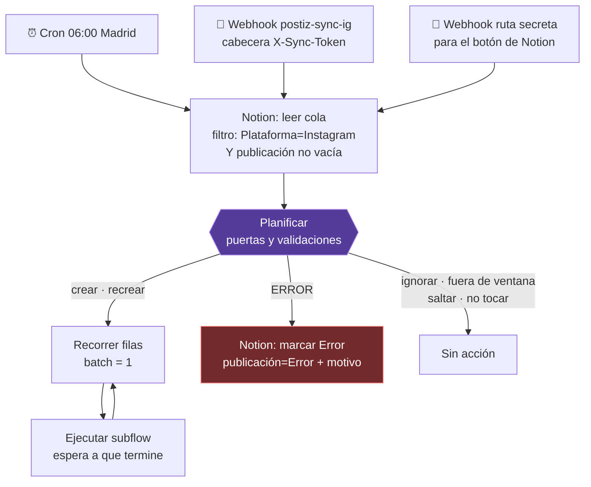

### Las puertas de `Planificar`, en orden

El **orden importa**: las validaciones estructurales van antes que la ventana y el margen.
Si no, una fila sin hora se parsea como medianoche UTC, cae dentro del margen de 2 h
y sale como «saltar» en vez de `Error` — lo contrario de la regla.

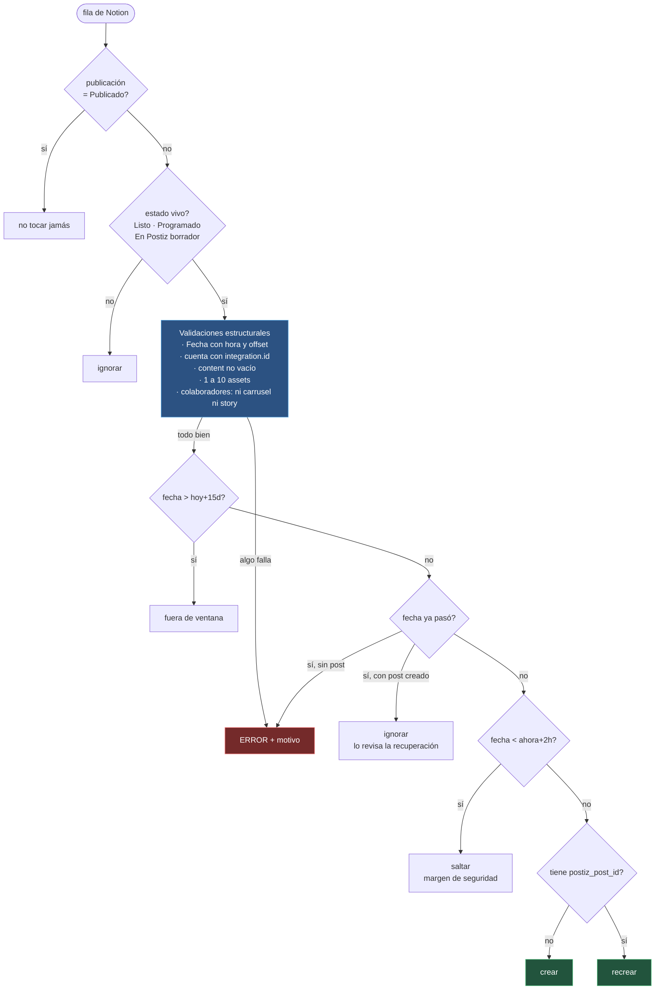

---

## 3. El subflow de una fila — `A0XMq6dLdAWvwMPv`

Aquí es donde se mueve todo. **Los bytes nunca pasan por n8n**: se le manda a Postiz
la URL firmada de Notion y él la descarga por streaming.

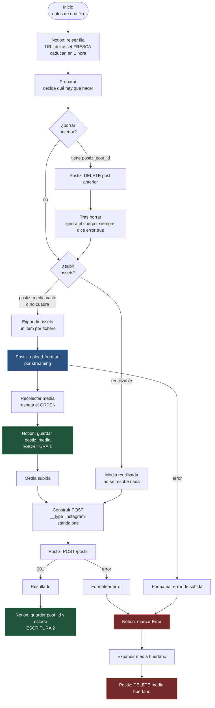

**Por qué dos escrituras y no una.** Guardar `postiz_media` en cuanto sube hace el proceso
reanudable: si algo falla después, el reintento **no vuelve a mover el fichero**.

**Por qué se borra el media al fallar.** La limpieza automática sólo hace candidato lo que
aparece en un post *publicado*. Un fichero subido y nunca publicado no lo recoge nadie —
ni a los 30 días ni nunca. Se borra **sólo si se subió en esa misma pasada**: si venía
reutilizado, borrarlo dejaría `postiz_media` apuntando a la nada.

---

## 4. Retirada y recuperación — `rxVcGlxSZjzzI5ez`

Reconciliar no es sólo crear lo que falta: es **retirar lo que ya no debe existir**.
Va 20 minutos después del sync para que los `postiz_post_id` ya estén escritos.

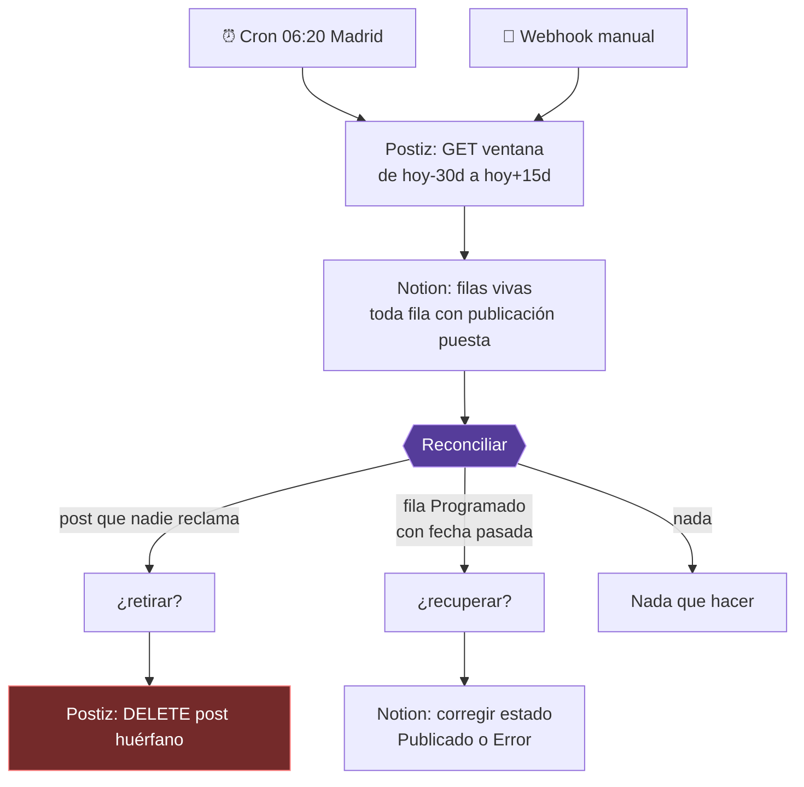

### Los tres filtros que evitan un desastre

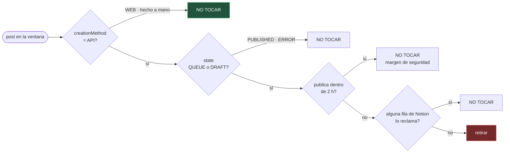

> **El primer filtro no es cosmético.** Un post creado desde la UI de Postiz no tiene fila
> en Notion, así que «borrar todo lo que nadie reclama» se lo llevaría. Cuando se auditó
> había uno real programado para agosto. Sin ese filtro, la primera pasada del cron
> lo habría borrado.

---

## 5. El receptor de estado — `VMezjZaMTIU5dIUz`

Postiz manda el webhook **sin ninguna cabecera de autenticación**, así que el secreto
va en la ruta. Y la regla de lectura no es la obvia.

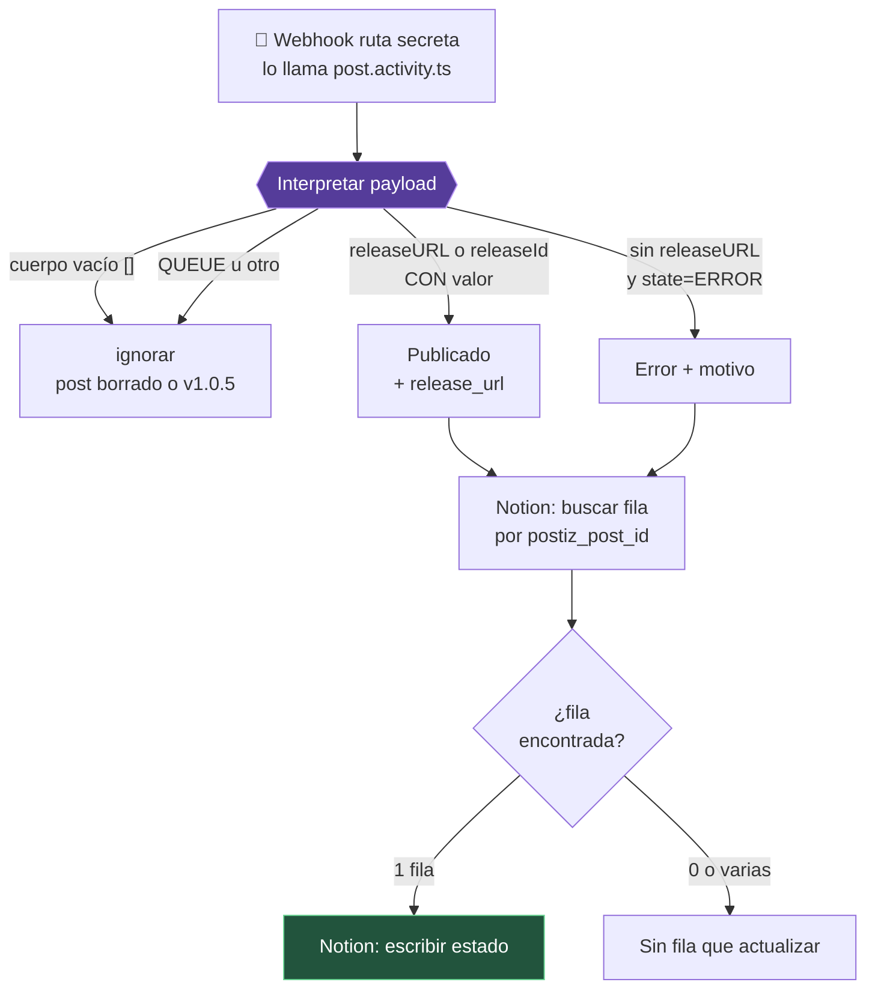

> ### ⚠️ `releaseURL` manda sobre `state`
> Si falla el primer comentario —donde van los hashtags—, Postiz marca el post padre como
> `ERROR` **pero conserva el permalink**: Instagram ya lo tiene publicado.
>
> Con la regla ingenua «`state=ERROR` ⇒ no publicó», la fila iría a `Error`, alguien la
> devolvería a `Listo` y el sync la recrearía: **segunda publicación en Instagram**.

---

## 6. La propiedad `publicación`, estado a estado

Sólo hay una transición que escribe una persona: **`Listo`**. Todo lo demás lo pone n8n.

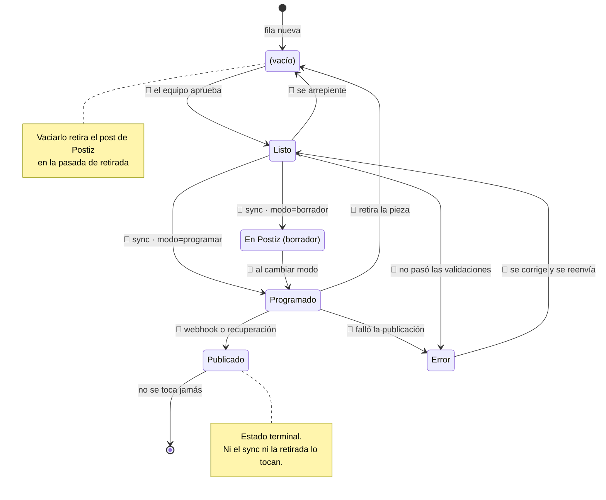

---

## 7. Un día cualquiera, en orden

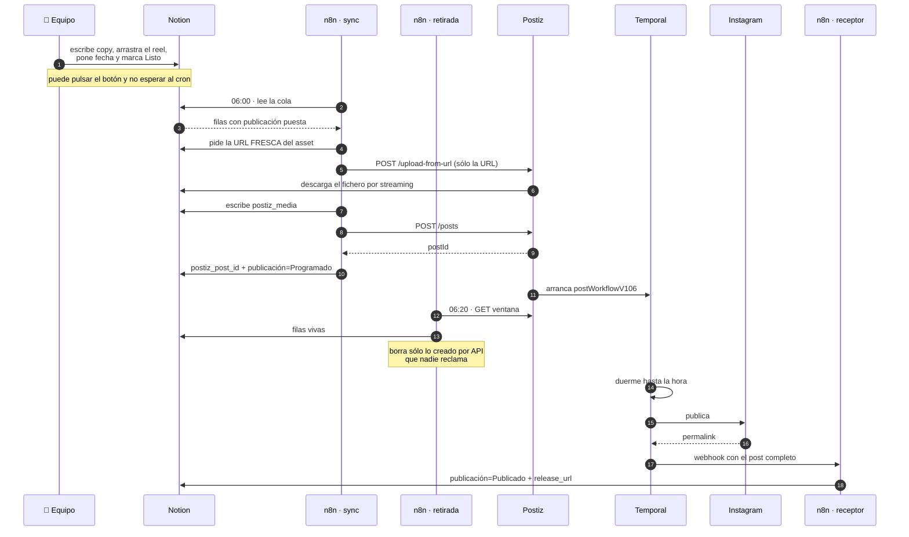

---

## 8. Qué pasa cuando algo falla, y quién lo recoge

| Falla | Lo detecta | La fila acaba en | ¿Se limpia? |
|---|---|---|---|
| Validación previa (sin hora, >10 assets, colaboradores en carrusel…) | `Planificar` | `Error` + motivo | No se subió nada |
| El asset no se puede descargar o pasa de 1 GiB | `upload-from-url` → 400 | `Error` + motivo de Postiz | No llegó a crearse media |
| `POST /posts` rechazado (copy largo, media inválido…) | subflow | `Error` + motivo | **Borra el media que acaba de subir** |
| Instagram rechaza al publicar | `postWorkflowV106` | `Error` vía webhook | El media sobrevive para el reintento |
| Falla el primer comentario tras publicar | receptor | **`Publicado`** + aviso | — |
| n8n caído cuando Postiz publica | pasada de recuperación 06:20 | `Publicado` o `Error` | — |
| Token de Instagram caducado | `refreshNeeded` → webhook | `Error` | — |
| Notion caído a las 06:00 | *nadie* | queda como estaba | ⚠️ **decisión abierta** |

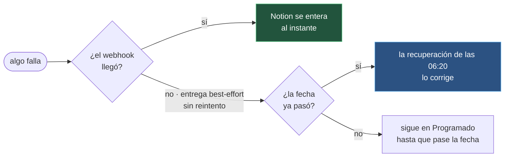

**El webhook es el camino rápido, no el único.** Su entrega es best-effort: `post.activity.ts`
envuelve el `fetch` en un `try/catch` vacío. Por eso existe la pasada de recuperación —
y por eso no se puede eliminar el polling del todo.

---

## 9. Dónde vive cada cosa

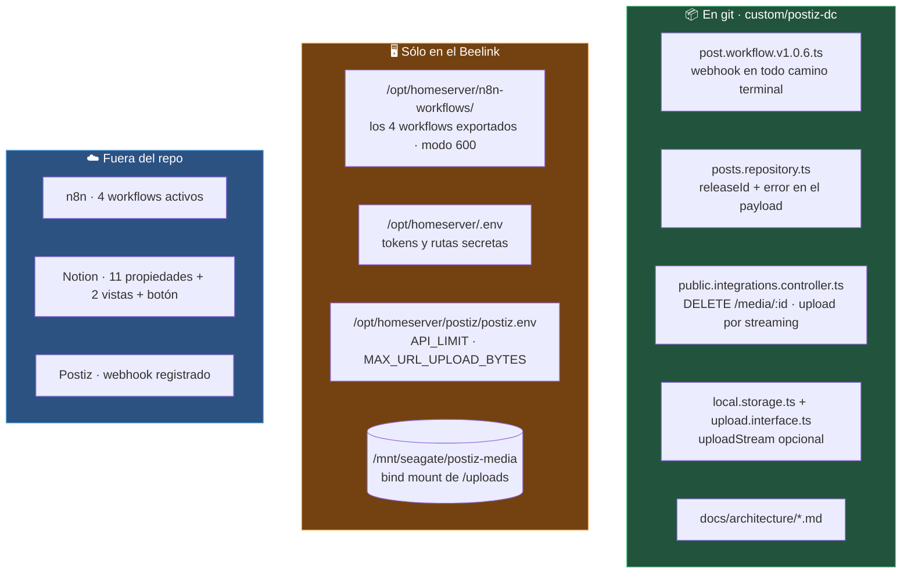

> **Los workflows no van a git a propósito.** Dos de ellos llevan rutas secretas dentro,
> y esto es un fork de un proyecto público: basta un push al remoto equivocado.
> La copia durable está en el servidor, con permisos `600`.

---

## 10. Los identificadores, de un vistazo

| Objeto | ID |
|---|---|
| Sync (cron 06:00 + botón) | `eKxZPM4zjwhNb3vf` |
| Subflow (una fila) | `A0XMq6dLdAWvwMPv` |
| Retirada y recuperación (cron 06:20) | `rxVcGlxSZjzzI5ez` |
| Receptor de estado | `VMezjZaMTIU5dIUz` |
| Calendario de Notion | `186a2405-a123-81dc-832f-000b82a65c0c` |
| Organización de Postiz | `30c506a6-0a2c-4661-95bb-abec2e14b3f2` |
| Dustin Calderón (IG) | `cmqjq77hg0001mw7y2xf6bg86` |
| CITEM (IG) | `cmqjqapu00003mw7yrudcwklj` |
| AMORISMO VOL III (IG) | `cmqjqfvnw0005mw7yoywgo6he` |

Las rutas secretas de los webhooks **no se escriben aquí**: viven en `/opt/homeserver/.env`
como `N8N_POSTIZ_WEBHOOK_PATH` y `N8N_SYNC_IG_BUTTON_PATH`.
