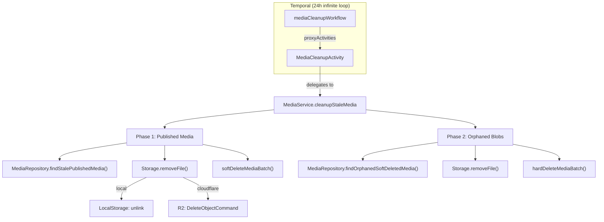

# 🗑️ Media Auto-Cleanup Pipeline

> **Estado**: ✅ Producción  
> **Última revisión**: 2026-08-04  
> **Responsable de diseño**: Custom fork (`custom/postiz-dc`)  
> **Relacionado**: [CONTENT_PIPELINE_NOTION_POSTIZ.md](./CONTENT_PIPELINE_NOTION_POSTIZ.md) — desde agosto de 2026 hay un worker que sube medios por API, y eso cambia el perfil de basura que genera el sistema (ver «Limitación conocida»).

---

## Regla de Negocio

**"Todo archivo de medios que haya sido usado en alguna publicación se elimina después de 30 días desde la fecha de publicación."**

La retención es configurable vía env var `MEDIA_RETENTION_DAYS` (default: `30`).

---

## Arquitectura General



---

## Lifecycle del Cleanup (2 fases)

### Phase 1 — Media usada en publicaciones antiguas

Identifica y elimina archivos de medios que ya cumplieron su función:

| Paso | Descripción |
|------|-------------|
| **Step 1** (Prisma) | Obtiene candidatos base: media no soft-deleted, no referenciada por FK (avatar, logo, icono), creada hace >retentionDays |
| **Step 2** (Raw SQL) | Filtra positivamente: solo candidatos cuyo `path` aparece en algún `Post.image` con `state='PUBLISHED'` y `publishDate < (now - retentionDays)`. Posts soft-deleted **sí cuentan** como prueba de uso. |
| **Step 3** (Raw SQL) | Excluye candidatos cuyo `path` aparece en posts **activos**: `QUEUE`, `DRAFT`, `ERROR`, `PUBLISHED` reciente (<30 días), o recurrentes (`intervalInDays IS NOT NULL`) |
| **Blob removal** | Elimina archivo físico de R2 o filesystem local |
| **Soft-delete** | Marca `deletedAt = now()` en la DB |

### Phase 2 — Blobs huérfanos de media soft-deleted

Limpia archivos físicos que el endpoint `DELETE /media/:id` dejó sin purgar (solo hace soft-delete):

| Paso | Descripción |
|------|-------------|
| **Query** | Media con `deletedAt` > 7 días (grace period para "undo") |
| **Blob removal** | Elimina archivo físico |
| **Hard-delete** | `DELETE FROM Media` — el registro ya no es auditable |

### Throughput

Ambas fases procesan en **batches de 100** y **loopean hasta vaciar** los candidatos, con un safety cap de **10 iteraciones por fase** (1000 archivos máximo por ciclo de 24h) para prevenir loops infinitos por bugs.

---

## Protecciones contra falsos positivos

| Protección | Implementación |
|------------|----------------|
| **FK Guards** | Prisma `none: {}` excluye media usada como `User.pictureId`, `SocialMediaAgency.logoId`, `OAuthApp.pictureId` |
| **Posts recurrentes** | `intervalInDays IS NOT NULL` → nunca se borra su media |
| **Posts en error** | `state = 'ERROR'` → retry posible, media protegida |
| **Posts en cola/borrador** | `state IN ('QUEUE', 'DRAFT')` → media protegida |
| **Posts recién publicados** | `PUBLISHED AND publishDate >= threshold` → protegida |
| **Posts eliminados** | Step 3 ignora posts con `deletedAt` (no protegen), pero Step 2 **sí los cuenta** como evidencia de uso |
| **Soft-delete primero** | Phase 1 no borra registros de DB, solo marca `deletedAt`. Reversible. |
| **Orphan grace period** | Phase 2 espera 7 días tras `deletedAt` antes de hard-delete |
| **Thumbnail safe** | Elimina thumbnail solo si es distinto del path principal. Fallo non-critical. |

---

## ⚠️ Limitación conocida: la media que nunca se publicó no la recoge nadie

El filtro del **Step 2 es positivo**: sólo es candidato lo que aparece en un `Post` con `state='PUBLISHED'`. Eso protege bien contra falsos positivos, pero deja un hueco simétrico:

> **Un fichero subido y nunca publicado no entra jamás en la Phase 1.** No es que tarde: es que no es candidato, ni a los 30 días ni a los tres años.

**La Phase 2 sí lo limpiaría**, porque `findOrphanedSoftDeletedMedia()` selecciona por `deletedAt` sin mirar si se publicó. El problema no está en la limpieza, está en **quién marca ese `deletedAt`**: hoy sólo una persona, desde la UI.

### Por qué esto importa más desde agosto de 2026

El pipeline Notion → Postiz sube cada asset con `POST /public/v1/upload-from-url` **antes** de crear el post. Si la creación falla después (validación de Instagram, red, throttle), el fichero queda subido y sin dueño.

Lo mitiga que el worker guarda `postiz_media` en cuanto sube y **reutiliza** ese valor al reintentar, así que un mismo asset no se duplica por reintento. Queda basura sólo cuando la fila se abandona sin corregirse.

**Opciones si algún día molesta** (ninguna implementada, es una decisión abierta):

| Opción | Coste |
|---|---|
| Que el worker borre el media si el `POST /posts` falla | No hay endpoint público de borrado de media — habría que añadirlo |
| Barrido periódico de media sin referencia en ningún `Post` y con `createdAt` antiguo | Una Phase 3; hay que ser muy cuidadoso con los FK guards |
| No hacer nada y soft-borrar a mano de vez en cuando | Gratis, y hoy suficiente al volumen que hay |

---

## Ficheros clave

| Archivo | Responsabilidad |
|---------|----------------|
| `libraries/.../media/media.repository.ts` | `findStalePublishedMedia()`, `softDeleteMediaBatch()`, `findOrphanedSoftDeletedMedia()`, `hardDeleteMediaBatch()` |
| `libraries/.../media/media.service.ts` | `cleanupStaleMedia()` — orquesta Phase 1 + Phase 2 con loops |
| `libraries/.../upload/local.storage.ts` | `removeFile()` — parsea URL, resuelve path, maneja ENOENT gracefully |
| `libraries/.../upload/cloudflare.storage.ts` | `removeFile()` — extrae key de URL, `DeleteObjectCommand` en R2 |
| `apps/orchestrator/.../media.cleanup.activity.ts` | Temporal Activity wrapper con logging |
| `apps/orchestrator/.../media.cleanup.workflow.ts` | `while(true) { cleanup(); sleep(24h); }` con try/catch resiliente |
| `libraries/.../temporal/infinite.workflow.register.ts` | Registro del workflow al arrancar con `RUN_CRON=true` |

---

## Formato de datos: `Post.image`

El campo `Post.image` es `String?` — un JSON serializado de `MediaDto[]`:

```json
[{"id":"abc123","path":"https://bucket.r2.dev/filename.png","alt":"Descripción"}]
```

El matching se hace con `LIKE '%' || media.path || '%'` contra este JSON string. Funciona porque `path` contiene un hash único (`makeId(10)` para R2, 32-char hex para local) que hace los falsos positivos imposibles.

---

## Esquema relevante (Prisma)

```prisma
model Media {
  id             String   @id @default(uuid())
  path           String
  thumbnail      String?
  deletedAt      DateTime?
  createdAt      DateTime @default(now())
  // FK relations que protegen contra borrado:
  userPicture    User[]
  agencies       SocialMediaAgency[]
  oauthApps      OAuthApp[]

  @@index([deletedAt, createdAt])  // Performance index para cleanup queries
}
```

---

## Configuración y Operación

### Variables de entorno

| Variable | Default | Descripción |
|----------|---------|-------------|
| `RUN_CRON` | `false` | Debe ser `true` para que el workflow se registre en Temporal |
| `MEDIA_RETENTION_DAYS` | `30` | Días desde publicación antes de que la media sea elegible |
| `STORAGE_PROVIDER` | `local` | `local` o `cloudflare` — determina cómo se borran blobs |

### Monitorización

```bash
# Verificar que el workflow está activo
docker logs postiz 2>&1 | grep -i 'MediaCleanup'

# Logs típicos de un ciclo exitoso:
# [MediaCleanupActivity] Starting media cleanup (retention: 30 days)...
# [MediaCleanupActivity] Media cleanup pass — candidates: 42, removed: 40, orphans: 3, failed: 2
```

### Temporal Workflow

- **WorkflowId**: `media-cleanup-workflow`
- **TaskQueue**: `main`
- **Ciclo**: 24 horas
- **Retry**: 3 intentos, backoff 2x, interval inicial 5 min
- **Timeout**: 15 min por activity execution
- **Resiliencia**: try/catch en el loop infinito — error non-retryable no mata el workflow

---

## Historial de Auditorías

### Auditoría v1 (2026-07-06) — 5 bugs corregidos

| Bug | Fix |
|-----|-----|
| `LocalStorage.removeFile()` crasheaba con URLs | Parse URL → filesystem path, ENOENT graceful |
| `deleteMedia()` no borraba blob físico | Phase 2 creada para limpiar orphans |
| `UNNEST` sin precedente en codebase | Reescrito con `Prisma.join()` + LIKE clauses |
| Sin heartbeat log con 0 candidatos | Log siempre |
| `while(true)` sin try/catch en workflow | Añadido try/catch resiliente |

### Auditoría v3 (2026-08-04) — sin bugs; una limitación documentada

Revisión provocada por el pipeline Notion → Postiz, que empezó a subir medios por API. **No se encontró ningún bug**: las dos fases hacen lo que este documento dice, verificado leyendo `media.repository.ts` y contra la base de producción.

| Comprobación | Resultado |
|---|---|
| Phase 2 recoge media soft-deleted **aunque nunca se publicara** | ✅ `findOrphanedSoftDeletedMedia()` filtra sólo por `deletedAt`, `:394-413` |
| Step 3 protege con `p."deletedAt" IS NULL` | ✅ `:338-350` |
| Step 2 cuenta posts soft-deleted como prueba de uso | ✅ `:304-319` |
| El workflow está vivo | ✅ `RUN_CRON=true`, `media-cleanup-workflow` con 29 ciclos completados |

Lo añadido es la sección **«Limitación conocida»**: el hueco no está en la limpieza sino en que nadie marca `deletedAt` de un fichero subido y nunca publicado.

### Auditoría v2 (2026-07-06) — 3 bugs corregidos

| Bug | Fix |
|-----|-----|
| JSDoc del workflow describía lógica incorrecta (antigua) | Actualizado a la regla de negocio correcta |
| `Post.deletedAt IS NULL` en Step 2 excluía posts borrados → media nunca se limpiaba | Removido filtro — posts borrados sí prueban uso |
| Batch único por ciclo (100/día) limitaba throughput del backlog inicial | Loop hasta vaciar con cap de 10 iteraciones |
