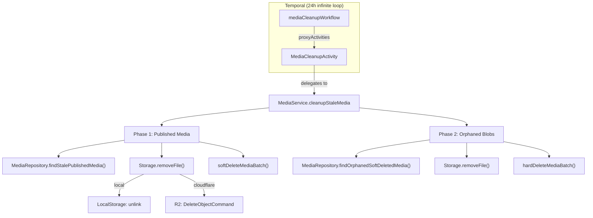

# 🗑️ Media Auto-Cleanup Pipeline

> **Estado**: ✅ Producción  
> **Última revisión**: 2026-08-04  
> **Responsable de diseño**: Custom fork (`custom/postiz-dc`)  
> **Relacionado**: [CONTENT_PIPELINE_NOTION_POSTIZ.md](./CONTENT_PIPELINE_NOTION_POSTIZ.md) — desde agosto de 2026 hay un worker que sube medios por API, y eso cambia el perfil de basura que genera el sistema (ver «Limitación conocida»). · [ARRANQUE_Y_SUPERVISION.md](./ARRANQUE_Y_SUPERVISION.md) — recrear el contenedor **no** cambia la retención, y ahí está el porqué.

> ### ⚠️ Un fichero en `/uploads` sin fila en `Media` no siempre es basura del pipeline
> Los **avatares** de los canales se guardan con `uploadSimple()`, que escribe el
> fichero y **no crea fila en `Media`**. Son invisibles para las dos fases de
> limpieza —que sólo seleccionan filas de `Media`—, así que ninguna puede
> borrarlos ni por error ni a propósito. El 2026-08-05 el disco tenía 61
> ficheros: 54 con fila, 4 avatares en uso y 3 avatares abandonados por
> refrescos de token anteriores. Ver la tabla final de
> [ARRANQUE_Y_SUPERVISION.md](./ARRANQUE_Y_SUPERVISION.md).

---

## Regla de Negocio

**"Todo archivo de medios que haya sido usado en alguna publicación se elimina después de `MEDIA_RETENTION_DAYS` días desde la fecha de publicación."**

La retención es configurable vía env var `MEDIA_RETENTION_DAYS`. **El default del código es `30`; producción está en `3650`** desde el 2026-08-04. El porqué —y la trampa que hace que cambiar la variable no baste— están en la sección siguiente.

---

## ⚠️ Cambiar `MEDIA_RETENTION_DAYS` no es cambiar la variable

**El workflow recibe la retención como argumento al arrancar; no la vuelve a leer nunca.** `infinite.workflow.register.ts:20-27` resuelve el número al iniciar el backend y lo pasa en `args`:

```ts
const retentionDays = Number(process.env.MEDIA_RETENTION_DAYS) || 30;
await ...workflow?.start('mediaCleanupWorkflow', {
  workflowId: 'media-cleanup-workflow',
  taskQueue: 'main',
  args: [retentionDays],
});
```

Y `media.cleanup.workflow.ts:34-48` es un `while (true)` con `sleep('24 hours')` que arrastra **ese mismo** `retentionDays` durante toda su vida.

No es un descuido: es una obligación de Temporal. El workflow corre en un sandbox determinista de V8 donde **`process.env` no existe** —lo dice el propio JSDoc del fichero—, así que el valor se lee fuera y viaja como argumento.

> ### ⚠️ Editar el `.env` y reiniciar el contenedor NO cambia la retención
> Al arrancar, `workflow.start` con un `workflowId` ya vivo lanza `WorkflowExecutionAlreadyStarted`, y el `catch (err) {}` de `:28-30` **se lo traga a propósito** («Workflow already running — expected on restart»). El arranque parece correcto, no hay error en los logs, y el workflow viejo sigue corriendo con su argumento antiguo hasta que alguien lo termine.
>
> Estas ejecuciones viven meses: la que corría hasta el 2026-08-04 arrancó el **2026-07-06** con `retentionDays = 30` y se ejecutaba a diario a las 12:38 UTC.

**El procedimiento correcto:**

1. Cambiar `MEDIA_RETENTION_DAYS` en `/opt/homeserver/postiz/postiz.env`.
2. **Terminar** `media-cleanup-workflow` en Temporal.
3. Reiniciar el contenedor `postiz` para que `InfiniteWorkflowRegister` lo relance.
4. **Leer el argumento en el historial de la ejecución nueva.** El arranque sin error no prueba nada — es exactamente el síntoma del fallo silencioso.

| Detalle operativo | Valor |
|---|---|
| WorkflowId | `media-cleanup-workflow` |
| Contenedor de Temporal | `temporal` — **no** `postiz-temporal` |
| Dirección para el CLI | `172.22.0.4:7233` — **no** `localhost:7233` |

### Aplicado el 2026-08-04: de 30 a 3650 días

`MEDIA_RETENTION_DAYS=3650` añadida a `/opt/homeserver/postiz/postiz.env` (copia previa: `postiz.env.bak-20260804-retention`). El workflow anterior se terminó y el nuevo arrancó con `retentionDays = ['3650']`, **verificado en el historial de Temporal**. La pasada inmediata no borró nada: 35 medios vivos y 54 ficheros en disco, antes y después.

**Por qué se subió.** El argumento de que 30 días eran seguros descansa entero en que Notion guarda el máster ([CONTENT_PIPELINE_NOTION_POSTIZ.md](./CONTENT_PIPELINE_NOTION_POSTIZ.md) §4.7). Es cierto para lo que pasa por el pipeline y **falso para todo lo anterior**: los 18 posts publicados desde la UI de Postiz no tienen fila en Notion, así que la caché del Seagate era su única copia. Nueve ya habían perdido sus ficheros —todo junio—; los otros nueve conservaban **201,0 MB** (191,7 MiB) en **18 ficheros distintos** que se habrían empezado a purgar el 2026-08-05.

> Este documento dio antes la cifra como **214,5 MB**, y era falsa por dos errores acumulados: contaba dos veces un `.mov` que referencian **dos publicaciones distintas** —18 ficheros, 19 referencias— y etiquetaba MiB como MB.

Lo anticipaba el propio documento del pipeline: *«Si algún día Postiz volviera a ser el único sitio donde vive el fichero, esta variable pasa a ser una bomba y hay que subirla»*. Lo que no vio es que ya lo era para el material antiguo.

Y no había red debajo: `/opt/homeserver/backup/backup-daily.sh` (cron de las 04:00) hace **sólo volcados de bases de datos y configuración**, sin una sola mención a Postiz, y aquel día ningún cron ni timer de systemd tocaba `/mnt/seagate`. Ni los medios ni la base de datos de Postiz estaban respaldados.

> ### ⚠️ Desde el 2026-08-04 sí hay dos crons sobre `/mnt/seagate` — y ninguno borra
> Los instaló [PLAN_ARCHIVO_DRIVE.md](./PLAN_ARCHIVO_DRIVE.md) §7.1: **`02:40`** el espejo del disco entero a Drive y **`02:55`** el archivador curado de lo publicado. Los dos **sólo leen y copian**: no borran nada de `/uploads`, ni tocan la base de datos, ni interfieren con el workflow de limpieza.
>
> ### ✅ Y desde el 2026-08-05 la base de datos **sí** se respalda
> `backup-daily.sh` no mencionaba Postiz ni una vez: su bucle de `pg_dump` recorre las bases de `postgres_core`, y Postiz vive en **su propio contenedor** (`postiz-postgres`), así que nunca entraba. Se añadió un volcado propio, que corre en el mismo cron de las 04:00 y **sube a R2** como el resto.
>
> Verificado restaurándolo de verdad en una base temporal, no mirando que el fichero exista: `Post` 115, `Integration` 4, `Media` 101, publicados vivos 19 y los 4 tokens — **idéntico a la base viva**.
>
> Lo que sigue siendo cierto es la otra mitad: **los medios no entran en `backup-daily.sh`**. Su segunda copia existe porque la hace el espejo a Drive de las 02:40, no porque el backup del servidor los cubra.

**3650 no es «desactivar la limpieza».** El workflow sigue vivo y las dos fases siguen corriendo; lo que deja de ocurrir es la purga automática por antigüedad. La Phase 2 —los blobs de lo que alguien borra a mano— es la que se usa a diario, y no depende de este número. Volver a bajarlo sólo tendrá sentido cuando exista una segunda copia real de cada fichero: es lo que persigue [PLAN_ARCHIVO_DRIVE.md](./PLAN_ARCHIVO_DRIVE.md).

---

## Arquitectura General



---

## Lifecycle del Cleanup (2 fases)

### Phase 1 — Media usada en publicaciones antiguas

Identifica y elimina archivos de medios que ya cumplieron su función:

| Paso | Descripción |
|------|-------------|
| **Step 1** (Prisma) | Obtiene candidatos base: media no soft-deleted, no referenciada por FK (avatar, logo, icono), creada hace >retentionDays |
| **Step 2** (Raw SQL) | Filtra positivamente: solo candidatos cuyo `path` aparece en algún `Post.image` con `state='PUBLISHED'` y `publishDate < (now - retentionDays)`. Posts soft-deleted **sí cuentan** como prueba de uso. |
| **Step 3** (Raw SQL) | Excluye candidatos cuyo `path` aparece en posts **activos**: `QUEUE`, `DRAFT`, `ERROR`, `PUBLISHED` reciente (dentro de la retención vigente, no «30 días»), o recurrentes (`intervalInDays IS NOT NULL`) |
| **Blob removal** | Elimina archivo físico de R2 o filesystem local |
| **Soft-delete** | Marca `deletedAt = now()` en la DB |

> ### ⚠️ Con la retención en 3650, la Phase 1 está inerte
> El Step 1 filtra por `createdAt < ahora − retención` (`media.repository.ts:275-282`), así que hoy sólo sería candidato un fichero **subido antes de 2016**. No habrá ninguno hasta **~2036**: la Phase 1 corre cada 24 h y sale siempre con cero candidatos.
>
> **Lo único que borra ficheros hoy es la Phase 2**, y sólo lo que ya tiene `deletedAt` en `Media` —es decir, lo que alguien borró a mano desde la UI o por `DELETE /public/v1/media/:id`—, pasado su periodo de gracia de 7 días. Cualquier razonamiento sobre «qué se está purgando» tiene que partir de ahí, no de la Phase 1.

### Phase 2 — Blobs huérfanos de media soft-deleted

Limpia archivos físicos que el endpoint `DELETE /media/:id` dejó sin purgar (solo hace soft-delete):

| Paso | Descripción |
|------|-------------|
| **Query** | Media con `deletedAt` > 7 días (grace period para "undo") |
| **Blob removal** | Elimina archivo físico |
| **Hard-delete** | `DELETE FROM Media` — el registro ya no es auditable |

### Throughput

Ambas fases procesan en **batches de 100** y **loopean hasta vaciar** los candidatos, con un safety cap de **10 iteraciones por fase** para prevenir loops infinitos por bugs.

> El cap es **por fase, no por ciclo**: `cleanupStaleMedia()` corre los dos bucles de `MAX_ITERATIONS = 10` de forma independiente. El techo real de una pasada de 24 h son **~2000 archivos** (1000 en Phase 1 + 1000 en Phase 2), no 1000.

---

## Protecciones contra falsos positivos

| Protección | Implementación |
|------------|----------------|
| **FK Guards** | Prisma `none: {}` excluye media usada como `User.pictureId`, `SocialMediaAgency.logoId`, `OAuthApp.pictureId` |
| **Posts recurrentes** | `intervalInDays IS NOT NULL` → nunca se borra su media |
| **Posts en error** | `state = 'ERROR'` → retry posible, media protegida |
| **Posts en cola/borrador** | `state IN ('QUEUE', 'DRAFT')` → media protegida |
| **Posts recién publicados** | `PUBLISHED AND publishDate >= threshold` → protegida |
| **Posts eliminados** | Step 3 ignora posts con `deletedAt` (no protegen), pero Step 2 **sí los cuenta** como evidencia de uso |
| **Soft-delete primero** | Phase 1 no borra registros de DB, solo marca `deletedAt`. Reversible. |
| **Orphan grace period** | Phase 2 espera 7 días tras `deletedAt` antes de hard-delete |
| **Thumbnail safe** | Elimina thumbnail solo si es distinto del path principal. Fallo non-critical. |

---

## ⚠️ Limitación conocida: la media que nunca se publicó no la recoge nadie

El filtro del **Step 2 es positivo**: sólo es candidato lo que aparece en un `Post` con `state='PUBLISHED'`. Eso protege bien contra falsos positivos, pero deja un hueco simétrico:

> **Un fichero subido y nunca publicado no entra jamás en la Phase 1.** No es que tarde: es que no es candidato, ni con la retención en 30 ni con ella en 3650.

**La Phase 2 sí lo limpiaría**, porque `findOrphanedSoftDeletedMedia()` selecciona por `deletedAt` sin mirar si se publicó. El problema no está en la limpieza, está en **quién marca ese `deletedAt`**: hoy sólo una persona, desde la UI.

### Por qué esto importa más desde agosto de 2026

El pipeline Notion → Postiz sube cada asset con `POST /public/v1/upload-from-url` **antes** de crear el post. Si la creación falla después (validación de Instagram, red, throttle), el fichero queda subido y sin dueño.

Lo mitiga que el worker guarda `❌ postiz_media` en cuanto sube y **reutiliza** ese valor al reintentar, así que un mismo asset no se duplica por reintento. Queda basura sólo cuando la fila se abandona sin corregirse.

**✅ Resuelto para el caso que lo generaba** (2026-08-04): se añadió **`DELETE /public/v1/media/:id`** a la API pública del fork y el worker borra lo que acaba de subir si el `POST /posts` falla, vaciando además `❌ postiz_media` para que el reintento vuelva a subir.

El endpoint espeja el borrado de la UI —soft-delete— en vez de inventar semántica nueva, así que el blob lo sigue quitando la Phase 2 pasado el periodo de gracia. Comprueba la pertenencia a la organización de forma explícita y devuelve `404` legible para un id ajeno, inexistente o ya borrado.

Verificado con un fallo real: 30 medios vivos antes y después.

**Lo que sigue sin cubrir** (y hoy no compensa):

| Caso | Por qué se deja |
|---|---|
| Subida parcial de un carrusel (asset 1 sube, asset 2 falla) | El primero queda huérfano. Raro, y arreglarlo obliga a arrastrar estado a medias por el subflow |
| Media subida por un cliente de API que simplemente la abandona | Ya no es nuestro caso; y un barrido genérico por «sin referencia en ningún Post» es peligroso con los FK guards |

### ⚠️ Corrección: los «11 huérfanos permanentes» no existían

Un primer análisis del 2026-08-04 contó **11 ficheros huérfanos permanentes (20,8 MB)** y los dio por basura recuperable. **Era falso.** Al buscar cada `path` en un volcado completo de la base:

| Ficheros | Qué eran de verdad |
|---|---|
| **10 de 11** | La **biblioteca de medios**, usada a propósito: carpetas `Citem/Audition Book - C1` … `C8`, con nombres originales `contact-sheet-c01.png` … `c08.png`. No aparecen en ningún post porque **nunca se pensaron para publicar** |
| **1 de 11** | Fuga real: `1f48184ea92abff016b10dbc5e4fcc179.mp4` (original `0619 (1).mp4`, 19,6 MB), del post `cmqknnxh30005q07ql8anll8d` — estado `QUEUE`, borrado el 2026-06-19, nunca publicado |

> ### ⚠️ «No aparece en ningún post» no significa «es basura»
> Una limpieza automática basada en aquel diagnóstico **habría borrado la biblioteca de medios entera**. La biblioteca es una función del producto: existe precisamente para guardar ficheros que aún no están en ningún post. Es el mismo error simétrico contra el que se diseñaron las protecciones de arriba, cometido desde fuera del código.

El mecanismo de fuga sí es estructural y sigue vigente —Phase 1 sólo recoge lo que aparece en un post **publicado**, Phase 2 sólo lo que tiene `deletedAt`, y un fichero subido y nunca publicado no cumple ninguna—, pero la **proporción real es 1 fichero en 7 semanas de uso**.

**El pipeline comparte esa fuga en un caso concreto.** En el subflow, el camino de recreación ejecuta `Postiz: DELETE post anterior`, que borra **el post, no sus medios**; el único `DELETE media huérfano` está en la rama de error. Si se cambian los ficheros de una fila ya sincronizada, los antiguos quedan vivos para siempre.

---

## Ficheros clave

| Archivo | Responsabilidad |
|---------|----------------|
| `libraries/.../media/media.repository.ts` | `findStalePublishedMedia()`, `softDeleteMediaBatch()`, `findOrphanedSoftDeletedMedia()`, `hardDeleteMediaBatch()` |
| `libraries/.../media/media.service.ts` | `cleanupStaleMedia()` — orquesta Phase 1 + Phase 2 con loops |
| `libraries/.../upload/local.storage.ts` | `removeFile()` — parsea URL, resuelve path, maneja ENOENT gracefully |
| `libraries/.../upload/cloudflare.storage.ts` | `removeFile()` — extrae key de URL, `DeleteObjectCommand` en R2 |
| `apps/orchestrator/.../media.cleanup.activity.ts` | Temporal Activity wrapper con logging |
| `apps/orchestrator/.../media.cleanup.workflow.ts` | `while(true) { cleanup(); sleep(24h); }` con try/catch resiliente |
| `libraries/.../temporal/infinite.workflow.register.ts` | Registro del workflow al arrancar con `RUN_CRON=true` — **y único sitio donde se lee `MEDIA_RETENTION_DAYS`** |

---

## Formato de datos: `Post.image`

El campo `Post.image` es `String?` — un JSON serializado de `MediaDto[]`:

```json
[{"id":"abc123","path":"https://bucket.r2.dev/filename.png","alt":"Descripción"}]
```

El matching se hace con `LIKE '%' || media.path || '%'` contra este JSON string. Funciona porque `path` contiene un identificador aleatorio suficientemente largo, que hace los falsos positivos inverosímiles.

> **No son hashes**, aunque lo parezcan: ninguno se deriva del contenido del fichero. R2 usa `makeId(10)` (`make.is.ts`), 10 caracteres alfanuméricos de `Math.random()`; local usa 32 dígitos hexadecimales, también de `Math.random()`. La unicidad es probabilística, no criptográfica — que para este uso basta, pero conviene no llamarlo hash y acabar razonando sobre una propiedad que no tiene.

---

## Esquema relevante (Prisma)

```prisma
model Media {
  id             String   @id @default(uuid())
  path           String
  thumbnail      String?
  deletedAt      DateTime?
  createdAt      DateTime @default(now())
  // FK relations que protegen contra borrado:
  userPicture    User[]
  agencies       SocialMediaAgency[]
  oauthApps      OAuthApp[]

  @@index([deletedAt, createdAt])  // Performance index para cleanup queries
}
```

---

## Configuración y Operación

### Variables de entorno

| Variable | Default | Descripción |
|----------|---------|-------------|
| `RUN_CRON` | `false` | Debe ser `true` para que el workflow se registre en Temporal |
| `MEDIA_RETENTION_DAYS` | `30` | Días desde publicación antes de que la media sea elegible. **En producción: `3650`.** Cambiarla no basta — ver «Cambiar `MEDIA_RETENTION_DAYS`…» |
| `STORAGE_PROVIDER` | `local` | `local` o `cloudflare` — determina cómo se borran blobs |

### Monitorización

```bash
# Verificar que el workflow está activo
docker logs postiz 2>&1 | grep -i 'MediaCleanup'

# Logs típicos de un ciclo exitoso:
# [MediaCleanupActivity] Starting media cleanup (retention: 3650 days)...
# [MediaCleanupActivity] Media cleanup pass — candidates: 42, removed: 40, orphans: 3, failed: 2
```

> **Ese `retention:` del log es el argumento con el que arrancó la ejecución, no el valor del `.env`.** Es la forma más rápida de detectar que el workflow vivo se quedó con un número viejo.

### Temporal Workflow

- **WorkflowId**: `media-cleanup-workflow`
- **TaskQueue**: `main`
- **Ciclo**: 24 horas
- **Retry**: 3 intentos, backoff 2x, interval inicial 5 min
- **Timeout**: 15 min por activity execution
- **Resiliencia**: try/catch en el loop infinito — error non-retryable no mata el workflow

---

## Historial de Auditorías

### Auditoría v4 (2026-08-04) — retención a 3650 y un diagnóstico corregido

| Hallazgo | Desenlace |
|---|---|
| La retención viaja como **argumento de workflow**, no como variable leída en cada ciclo | Documentado arriba. Es el conocimiento más caro de la revisión: cambiar el `.env` y reiniciar **no hacía nada** |
| El workflow vivo llevaba desde el **2026-07-06** con `retentionDays = 30` | Terminado y relanzado. `retentionDays = ['3650']` verificado en el historial de Temporal |
| Los 18 posts publicados desde la UI **no tienen fila en Notion** | La caché era su única copia. 9 ya sin ficheros; 9 con 201,0 MB (18 ficheros) a punto de purgarse el 2026-08-05 |
| **No existía ninguna copia de seguridad** de los medios ni de la base de Postiz | **Resuelto en dos pasos.** Los medios: espejo a Drive de las 02:40 desde el 2026-08-04. La base: volcado propio dentro de `backup-daily.sh` desde el **2026-08-05**, verificado restaurándolo. No entraba porque el bucle de `pg_dump` sólo recorre `postgres_core` y Postiz tiene contenedor aparte |
| Los «11 huérfanos permanentes (20,8 MB)» del análisis previo | **Falso.** 10 eran la biblioteca de medios; 1 era fuga real. Ver «Corrección» |

Sin bugs en el código: las dos fases siguen haciendo lo que este documento dice.

### Auditoría v1 (2026-07-06) — 5 bugs corregidos

| Bug | Fix |
|-----|-----|
| `LocalStorage.removeFile()` crasheaba con URLs | Parse URL → filesystem path, ENOENT graceful |
| `deleteMedia()` no borraba blob físico | Phase 2 creada para limpiar orphans |
| `UNNEST` sin precedente en codebase | Reescrito con `Prisma.join()` + LIKE clauses |
| Sin heartbeat log con 0 candidatos | Log siempre |
| `while(true)` sin try/catch en workflow | Añadido try/catch resiliente |

### Auditoría v3 (2026-08-04) — sin bugs; una limitación documentada

Revisión provocada por el pipeline Notion → Postiz, que empezó a subir medios por API. **No se encontró ningún bug**: las dos fases hacen lo que este documento dice, verificado leyendo `media.repository.ts` y contra la base de producción.

| Comprobación | Resultado |
|---|---|
| Phase 2 recoge media soft-deleted **aunque nunca se publicara** | ✅ `findOrphanedSoftDeletedMedia()` filtra sólo por `deletedAt`, `:394-413` |
| Step 3 protege con `p."deletedAt" IS NULL` | ✅ `:338-350` |
| Step 2 cuenta posts soft-deleted como prueba de uso | ✅ `:304-319` |
| El workflow está vivo | ✅ `RUN_CRON=true`, `media-cleanup-workflow` con 29 ciclos completados |

Lo añadido es la sección **«Limitación conocida»**: el hueco no está en la limpieza sino en que nadie marca `deletedAt` de un fichero subido y nunca publicado.

### Auditoría v2 (2026-07-06) — 3 bugs corregidos

| Bug | Fix |
|-----|-----|
| JSDoc del workflow describía lógica incorrecta (antigua) | Actualizado a la regla de negocio correcta |
| `Post.deletedAt IS NULL` en Step 2 excluía posts borrados → media nunca se limpiaba | Removido filtro — posts borrados sí prueban uso |
| Batch único por ciclo (100/día) limitaba throughput del backlog inicial | Loop hasta vaciar con cap de 10 iteraciones |
